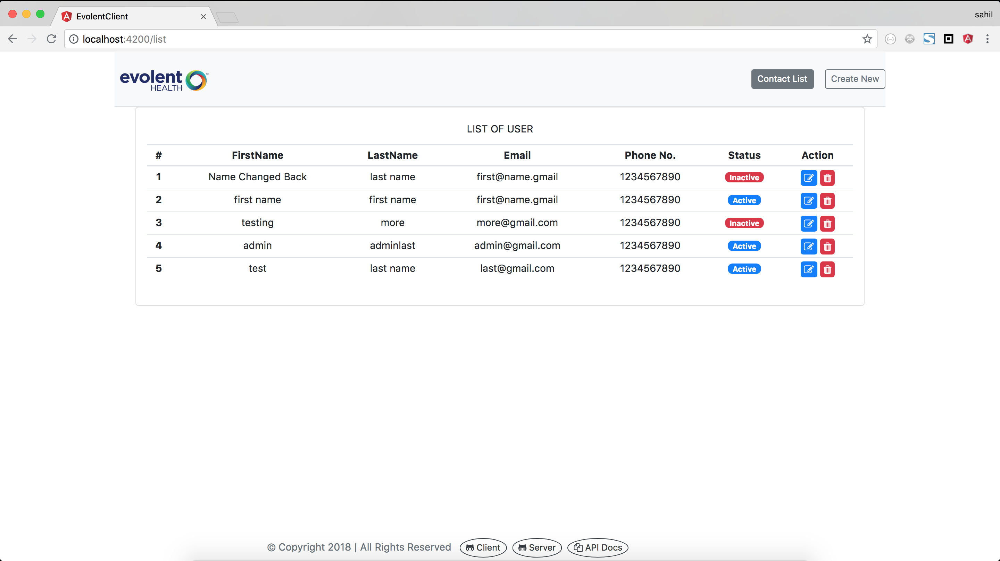
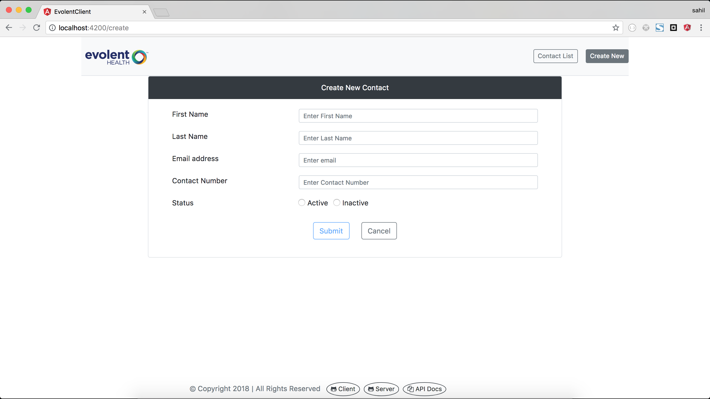

# Evolent Client

## Contact Form Exercise build with technologies.
* Angular 6
* NodeJs
* Mongodb
* Express
* Gulp

Demo of application can be found at [DEMO LINK](https://evolent-exercise.herokuapp.com/);
 link``https://evolent-exercise.herokuapp.com``

* **Frontend** Project Code  [GitHub Link](https://github.com/meanMonk/evolent-client)
* **backend** Project Code  [GitHub Link](https://github.com/meanMonk/evolent-server)
* **Rest** API Documents  [DOC LINK](https://evolent-exercise.herokuapp.com/api-docs)
  
This project was generated with Angular CLI version 6.1.1.

### Production build

*please make sure that you have cloned client project and server project repo in same directory*

>> Run `ng build --prod` to generate the production build. 
The build artifacts will be stored in the `evolent-server/dist/` directory if you have both project in same directory. 

### Development server 

*Please start Mongodb server on your local and run the below command to start the server*

>> Run `npm run start:dev` to start the server which will be listen at localhost:8080. 

### Production server 

*Please start Mongodb server on your local and run the below command to start the server*

>> Run `npm run start` to start the server which will be listen at localhost:8080. 

# Running Unit test cases
>> Run `npm run unit-test` which will print the unit test result on terminal. 

Project Images : 

